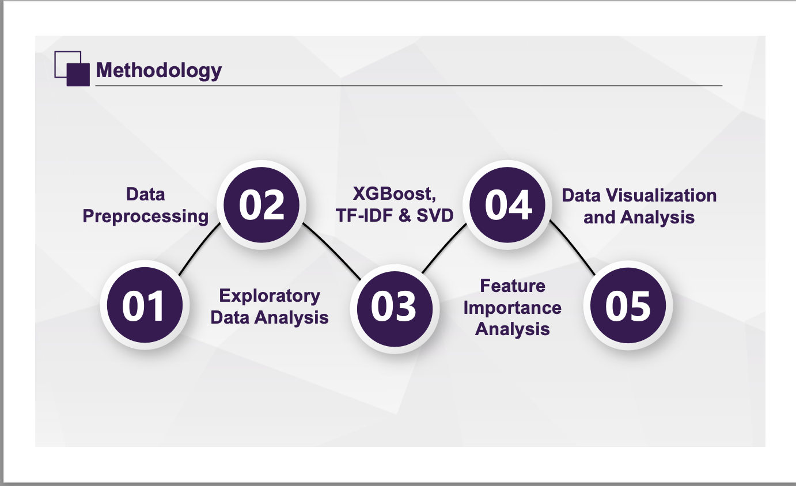
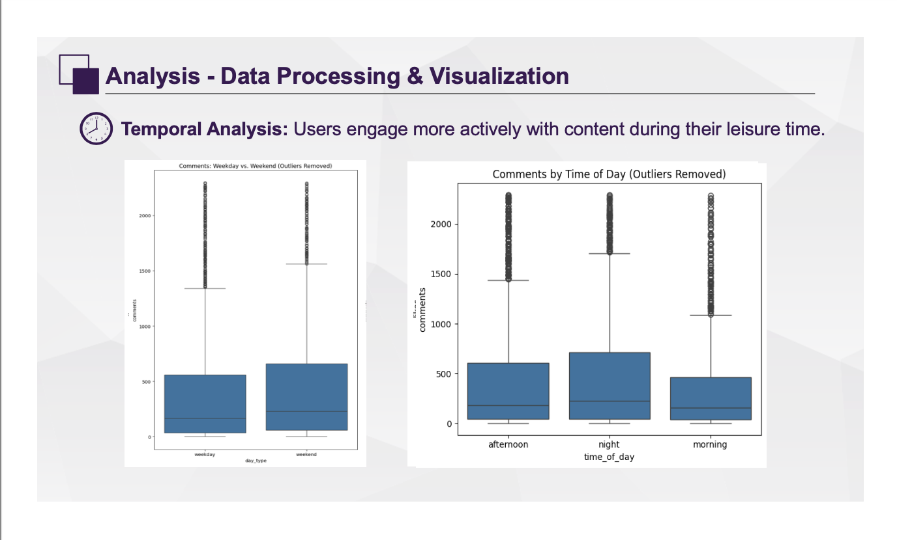

# 🎥 YouTube Engagement Prediction with XGBoost & NLP

Welcome to our project exploring what drives YouTube video engagement. Using **XGBoost**, **TF-IDF**, and structured feature engineering, we analyze how likes, comments, and views are influenced — and how to optimize content strategy accordingly.

---

## 📌 Project Summary

**Objective:**  
Predict and understand YouTube video engagement using machine learning and natural language processing.

---

## 🧭 Methodology

We followed a structured five-step process:
1. Data Preprocessing  
2. Exploratory Data Analysis  
3. Modeling with XGBoost, TF-IDF & SVD  
4. Feature Importance Analysis  
5. Visualization & Interpretation

---

## 📊 Data Processing & Correlation Insights

- Handled missing values, encoded categories, analyzed sentiment.
- **Word Cloud:** Keywords like “show”, “business”, and “tutorial” appear frequently.
- **Correlation Matrix:** Strongest link is between views and likes. Sentiment has weaker correlations.

---

## 📈 Temporal Engagement Patterns

- **Weekends** and **afternoons** show higher engagement.
- Insight: Users interact more during leisure hours — timing matters!

---

## 📌 Feature Importance with XGBoost

- Top Driver: `views` (0.484) — key for algorithmic visibility.
- Other contributors: `category`, `duration`, and `description sentiment`.
- Least impact: `posting time`, `day type`.

---

## ✍️ NLP Modeling: TF-IDF + SVD

- **TF-IDF:** Converts text into features  
- **SVD:** Reduces dimensionality  
- Improved MSE for:
  - Comments: 3.38 → 2.51  
  - Likes: 3.82 → 3.50  
- High-engagement keywords: “cats”, “collection”, “business ideas”, “amazing”

---

## ✅ Strategic Recommendations

| Action | Reason |
|--------|--------|
| 🎯 Use high-impact keywords | Increases searchability and discoverability |
| 🖼️ Focus on thumbnails & CTR | Higher click-through = higher views |
| 🗓️ Post during peak times | Afternoons and weekends perform better |
| 💬 Drive interaction | Comments & polls fuel algorithm visibility |

---

