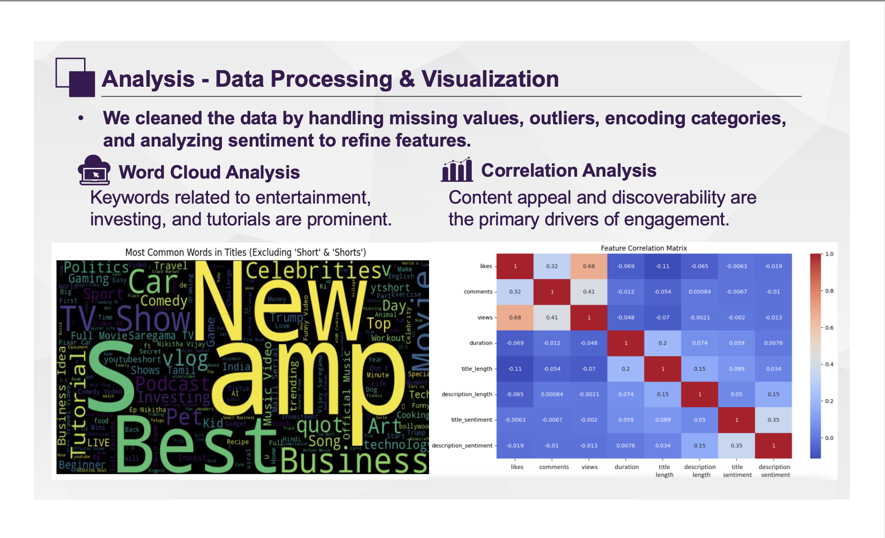
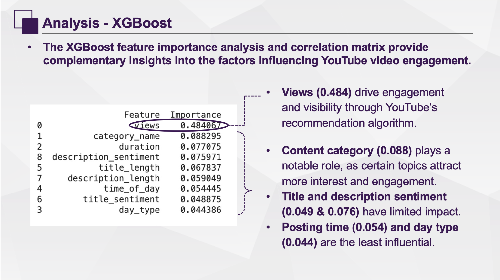
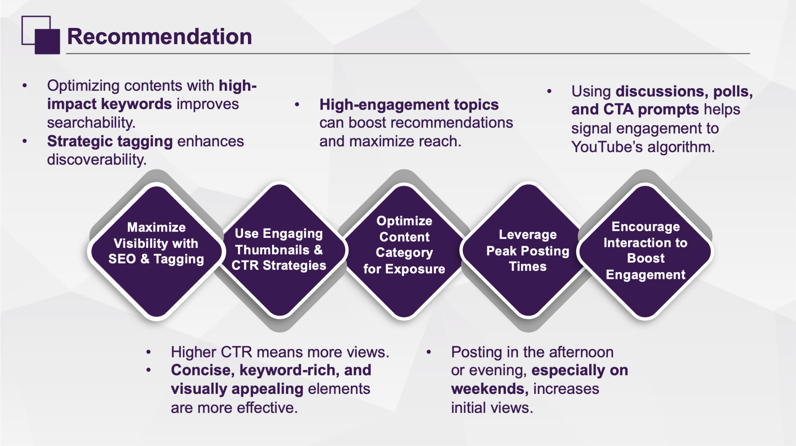

# 🎥 YouTube Engagement Prediction with XGBoost & NLP

Welcome to our project exploring what drives YouTube video engagement. Using **XGBoost**, **TF-IDF**, and structured feature engineering, we analyze how likes, comments, and views are influenced — and how to optimize content strategy accordingly.

---

## 📌 Project Summary

**Objective:**  
Predict and understand YouTube video engagement using machine learning and natural language processing.

---

## 🔍 Data Overview

**Source:** YouTube Data API  
**Features Used:**
- Video metadata (title, description, duration, category)
- Engagement stats (likes, comments, views)
- Posting time, day type
- NLP features (TF-IDF, sentiment, word count)

**Tech Stack:**
- Python, Jupyter
- XGBoost
- TF-IDF + SVD
- Matplotlib / Seaborn for visuals

---

## 📊 Data Processing & EDA

- Cleaned missing values, outliers, and encoded categorical variables.
- **Word Cloud:** Highlights entertainment, investing, and tutorial keywords as major engagement drivers.
- **Correlation Matrix:** Views strongly drive likes and comments. Sentiment features are weakly correlated.

---

## 🔎 Feature Importance – XGBoost

- **Top Features:**
  - `views` (importance = 0.484) is the strongest predictor
  - `category`, `duration`, and `description sentiment` follow
- **Weaker Features:**
  - Posting time and title sentiment have limited impact

---

## ✍️ NLP with TF-IDF + SVD

**Why it matters:**
- **TF-IDF** converts titles/descriptions into weighted keyword vectors
- **SVD** reduces dimensionality while preserving topic relevance

**Result:**
- MSE for likes dropped from **3.82 → 3.50**
- MSE for comments dropped from **3.38 → 2.51**

---

## ✅ Strategic Recommendations

| Action | Reason |
|--------|--------|
| 🎯 Use high-impact keywords | Increases searchability and discoverability |
| 🖼️ Focus on thumbnails & CTR | Higher click-through = higher views |
| 🗓️ Post during peak times | Afternoons and weekends perform better |
| 💬 Drive interaction | Comments & polls fuel algorithm visibility |

---

## 📁 Project Structure

